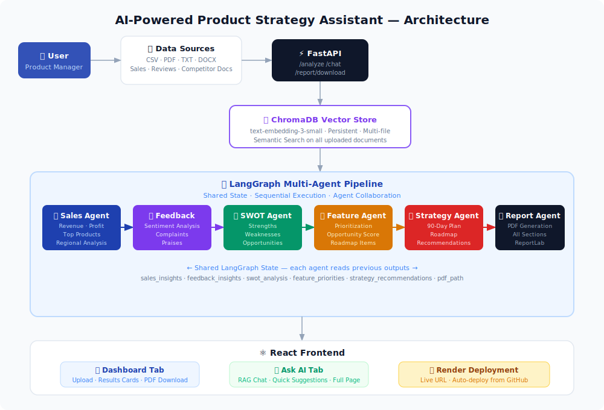

# AI-Powered Product Strategy Assistant

An intelligent multi-agent system that helps Product Managers analyze business data, generate strategic insights, and make data-driven decisions — powered by GPT-4o Mini, LangGraph, ChromaDB, FastAPI, and React.

---

## Live Demo

> **Deployed URL:** [https://afde-ai-powered-product-strategy.onrender.com](https://afde-ai-powered-product-strategy.onrender.com)
> **GitHub Repo:** [shriram0511/AFDE_AI-Powered-Product-Strategy-Assistant](https://github.com/shriram0511/AFDE_AI-Powered-Product-Strategy-Assistant)
> **Sample Report (PDF):** [product_strategy_report.pdf](backend/reports/product_strategy_report_20260601_185649.pdf)

---

## Overview

Product Managers deal with large volumes of data — customer reviews, sales reports, competitor research, and market trends. This assistant automates that analysis using 6 collaborative AI agents that work together to produce a complete product strategy report.

---

## Architecture



```
User Uploads File (CSV / PDF / TXT / DOCX)
              ↓
        FastAPI Backend
              ↓
     ChromaDB Vector Store
     (text-embedding-3-small)
              ↓
       LangGraph Pipeline
              ↓
  ┌─────────────────────────┐
  │   Agent 1: Sales Agent  │ → revenue, profit, top products, regions
  │   Agent 2: Feedback     │ → sentiment, complaints, praises
  │   Agent 3: SWOT         │ → strengths, weaknesses, opportunities, threats
  │   Agent 4: Feature      │ → priorities, opportunity scores
  │   Agent 5: Strategy     │ → 90-day plan, roadmap, recommendations
  │   Agent 6: Report       │ → PDF generation (all sections combined)
  └─────────────────────────┘
              ↓
     React Frontend
     ├── Dashboard Tab (results + PDF download)
     └── Ask AI Tab    (RAG-powered chat)
```

---

## Tech Stack

| Layer | Technology |
|---|---|
| LLM | GPT-4o Mini (via instructor gateway) |
| Embeddings | text-embedding-3-small |
| Agent Orchestration | LangGraph |
| Framework | LangChain |
| Vector Database | ChromaDB (persistent) |
| Backend | FastAPI |
| Frontend | React + Vite |
| PDF Generation | ReportLab |
| Deployment | Render |

---

## Agent Descriptions

| Agent | Role | Input | Output |
|---|---|---|---|
| Sales Agent | Analyzes revenue, profit, product performance | ChromaDB (sales data) | Top/bottom products, regional analysis, ROI |
| Feedback Agent | Sentiment analysis on customer reviews | ChromaDB (reviews) | Sentiment %, complaints, praises |
| SWOT Agent | Generates SWOT matrix | Sales + Feedback outputs | Strengths, Weaknesses, Opportunities, Threats |
| Feature Agent | Prioritizes product improvements | Feedback + ChromaDB | Ranked feature list with opportunity scores |
| Strategy Agent | Creates strategic plan | All agent outputs | 90-day plan, roadmap, recommendations |
| Report Agent | Generates PDF | All agent outputs | Formatted PDF report |

---

## Project Structure

```
Assignment-AI Powered Product Strategy Assistant/
├── backend/
│   ├── main.py              # FastAPI app (4 endpoints)
│   ├── state.py             # LangGraph shared state
│   ├── llm_client.py        # GPT-4o Mini + embedding client
│   ├── ingest.py            # File parsing + ChromaDB ingestion
│   ├── graph.py             # LangGraph pipeline
│   ├── requirements.txt
│   └── agents/
│       ├── sales_agent.py
│       ├── feedback_agent.py
│       ├── swot_agent.py
│       ├── feature_agent.py
│       ├── strategy_agent.py
│       └── report_agent.py
├── frontend/
│   ├── src/
│   │   ├── App.jsx
│   │   ├── index.css
│   │   └── components/
│   │       ├── UploadPanel.jsx
│   │       ├── ResultsPanel.jsx
│   │       └── ChatInterface.jsx
│   ├── package.json
│   └── vite.config.js
├── Sample Sales Data.csv
└── README.md
```

---

## Setup & Run Locally

### Prerequisites
- Python 3.10+
- Node.js 18+

### Backend

```bash
cd backend
pip install -r requirements.txt
uvicorn main:app --reload --port 8000
```

### Frontend

```bash
cd frontend
npm install
npm run dev
```

Open `http://localhost:5173`

---

## API Endpoints

| Method | Endpoint | Description |
|---|---|---|
| GET | /health | Health check |
| POST | /analyze | Upload file → run 6 agents → return results |
| POST | /chat | Ask a question → RAG answer from ChromaDB |
| GET | /report/download | Download generated PDF report |

---

## Supported File Types

| Format | Use Case |
|---|---|
| `.csv` | Sales data, product analytics |
| `.pdf` | Market research, competitor reports |
| `.txt` | Customer reviews, survey responses |
| `.docx` | Feature requests, business documents |
| `.md` | Product specs, documentation |

---

## Sample Generated Outputs

After uploading `Sample Sales Data.csv`, the system generates:

1. **Sales Performance** — Top 3 products by revenue, regional breakdown, ROI analysis
2. **Customer Feedback** — 58% positive sentiment, top complaints, product ratings
3. **SWOT Analysis** — Data-backed strengths, weaknesses, opportunities, threats
4. **Feature Priorities** — Ranked list with scores (Build Quality: 10/10, Customer Support: 9/10)
5. **Strategic Recommendations** — 90-day action plan, 6-month roadmap
6. **PDF Report** — All sections in a downloadable formatted report

---

## Evaluation Criteria Coverage

| Criteria | Coverage |
|---|---|
| Successful Deployment (30%) | ✅ Deployed on Render |
| Quality of AI Insights (35%) | ✅ 6 specialized agents with ChromaDB RAG |
| Multi-Agent Design + UX (35%) | ✅ LangGraph pipeline, React UI, PDF download |

---

## Bonus Features Implemented

- ✅ Advanced Multi-Agent Collaboration (LangGraph shared state)
- ✅ Product Opportunity Scoring (feature_agent)
- ✅ Roadmap Generation (strategy_agent)
- ✅ Interactive Dashboard (React with stats cards)

---

## Team / Author

- **Name:** Shriram Kumar
- **Email:** shriramkumar.an@prodapt.com
- **Program:** AFDE — Prodapt Chennai
